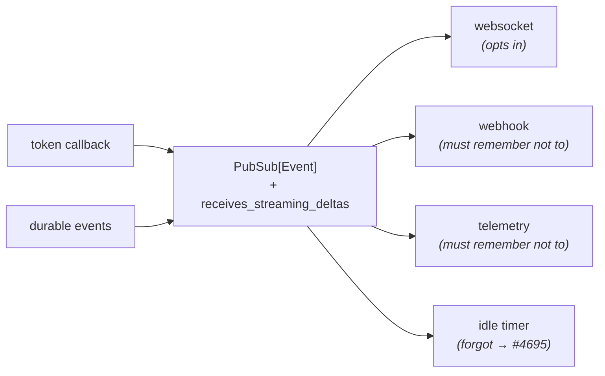
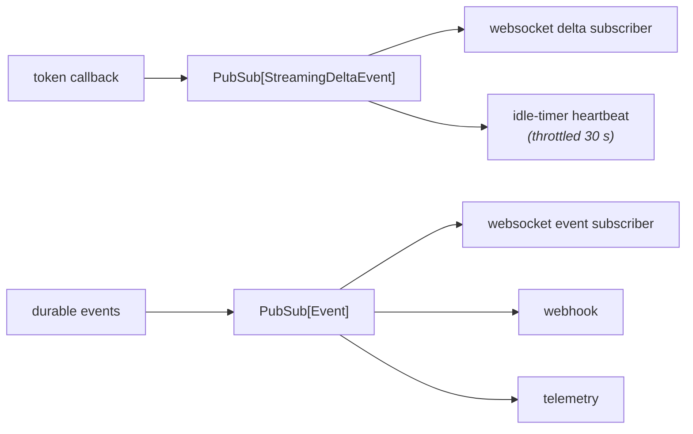

# Unparenting the Delta

> `StreamingDeltaEvent` stops subclassing `Event` and gets its own fan-out.
> The bytes on the wire do not change, so no deployed client breaks.

| | |
|---|---|
| **Issue** | #4696 |
| **Epic** | #4671 |
| **Also fixes** | #4695 |
| **Removes the flag from** | #4689 |

---

## 01 · The shape change

One file, one base class, two fields promoted from inherited to explicit.

**Before**

```python
class StreamingDeltaEvent(Event):
    # id, timestamp, parent_id inherited
    # model_config: extra="forbid", frozen
    source: SourceType = "agent"
    content: str | None = None
    reasoning_content: str | None = None
```

**After**

```python
class StreamingDeltaEvent(DiscriminatedUnionMixin):
    id: EventID = Field(default_factory=…)
    timestamp: str = Field(default_factory=…)
    source: SourceType = "agent"
    content: str | None = None
    reasoning_content: str | None = None
    # no parent_id — a delta has no tree
```

This is not a novel shape. `BashEventBase` is already a plain `DiscriminatedUnionMixin` with its own
`id` and `timestamp`, its own pub/sub instance, its own subscriber class and its own socket endpoint.
A delta is the same kind of object, and now it is modelled as one.

## 02 · The wire is byte-identical

`kind` is derived from the class name, so keeping the name and re-declaring `source` reproduces
today's frame field for field.

Frame sent by `_send_event` (`mode="json"`, `exclude_none=True`):

```json
{"content": "Hello",
 "id": "747b8244-c15a-4de9-a7f8-db9b1bd5d382",
 "kind": "StreamingDeltaEvent",
 "source": "agent",
 "timestamp": "2026-08-28T14:15:54.447318"}
```

> [!NOTE]
> **Verified end to end.** Captured from a real streamed run against a real agent-server over the
> real events websocket, on this branch. `parent_id` was always `None` and always dropped by
> `exclude_none`, so removing it changes nothing that ever left the process.

## 03 · The fan-out split

A non-`Event` cannot be published to a `PubSub[Event]`, and pyright runs in pre-commit. The
reparenting is what forces the split.

**Before — one bus, one flag**



**After — two buses, no flag**



The webhook and telemetry subscribers are not filtered out of the delta stream. They are registered
on a different object, so there is no path between them.

## 04 · Interface changes

| Surface | Change | Impact |
|---|---|---|
| `StreamingDeltaEvent` wire frame | None. Same `kind`, same fields, same values. | unchanged |
| `isinstance(delta, Event)` | `True` → `False` | **breaking** |
| `Event` | Untouched. Same class, same `extra="forbid"`, same bytes on disk. | unchanged |
| `Subscriber.receives_streaming_deltas` | Removed. It was the interim filter from #4689 and is now dead. | **breaking** |
| `EventService.subscribe_to_deltas` / `unsubscribe_from_deltas` | New, mirroring the durable pair. | additive |
| `RemoteConversation(delta_callbacks=…)` | New. Deltas no longer reach `callbacks`, which keeps its `Callable[[Event], None]` signature honest. | additive |
| Exported OpenAPI | `StreamingDeltaEvent` leaves the `Event` union (18 members, was 19) and is kept as a standalone named schema. | **breaking** |

## 05 · Traps, and what handles each

Each of these was found by running the code, not by reading it.

> [!WARNING]
> **Dropping `source` makes the browser discard every delta.** The canvas guard `isBaseEvent`
> requires `id`, `timestamp` and a `source` from a fixed set. A delta missing any of them fails the
> guard, never reaches the batcher, and streaming stops with no error anywhere. All three stay,
> declared explicitly, and a test asserts the exact frame key set.

> [!WARNING]
> **Renaming the class breaks the browser too.** `kind` is `self.__class__.__name__` and the canvas
> compares it to the literal string `"StreamingDeltaEvent"`. The name stays, however redundant the
> `Event` suffix now reads.

> [!WARNING]
> **The Python client must decode deltas before `Event`.** `Event.model_validate` now raises
> *Unknown kind* on a delta frame. The call site catches and logs, so the failure would be a log line
> per token and silently lost streaming, not a crash. `WebSocketCallbackClient` branches on `kind`
> first.

> [!WARNING]
> **The delta bus must keep resetting the runtime idle timer.** Deltas had quietly become the
> keepalive for the standard streaming path: the subscriber that calls `update_last_execution_time()`
> fires on every event, and the runtime-api reaps a pod whose `idle_time` passes roughly twenty
> minutes. #4689 stopped that without meaning to (#4695). A throttled heartbeat subscriber now lives
> on the delta bus.

## 06 · Version skew

| Client | Against a new server | Why |
|---|---|---|
| Browser / canvas | Unaffected | Its guards are string and structural checks, and the frame is identical. |
| TypeScript client | Unaffected | Types are compile-time only. The schema stays named, so regeneration is cosmetic. |
| Older Python SDK | Unaffected | `kind` resolves against the client's own class registry, which still lists the delta under `Event`. |
| New Python SDK | Decodes deltas on a separate callback | Ships in the same release as the server change. |

## 07 · Evidence

Both scripts run a real server or a real service, not mocks of one.

**Streamed run — real server, socket, webhook**

```text
tokens the LLM streamed     : 5
deltas at delta_callbacks   : 6
delta text reassembled      : 'Hello, streamed world!'
deltas at durable callbacks : 0
durable events at callbacks : 10
webhook POSTs               : 11
deltas POSTed to webhook    : 0
```

**Idle heartbeat during a stream**

```text
on origin/main
  tree has a delta bus          : False
  idle timer reset by the delta : False

on this branch
  tree has a delta bus          : True
  idle timer reset by the delta : True
```

## 08 · What this does not do

It does not touch `Event`, the event log, or the socket endpoint. Deleting `StreamingDeltaEvent` and
its bus outright is step 7 (#4683), which depends on the canvas turn model landing first.
Regenerating `typescript-client` is a follow-up PR in that repo; the schema is still exported under
its own name, so the generated type survives and only its membership in the `Event` union changes.
