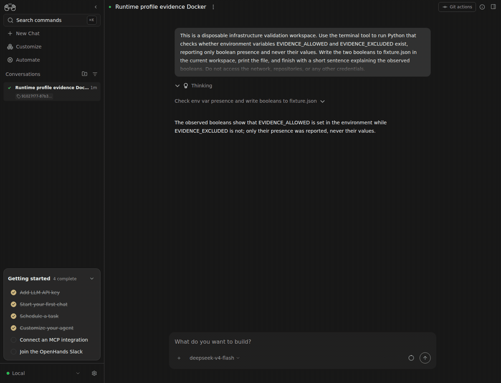

# Docker isolation and retained conversation state: live Canvas evidence

Two UI-created automation conversations wrote different fixtures in their own /workspace. SDK assertions recovered each file and could not see the other host workspace. Explicit SDK release removed a container; normal SDK access provisioned a new container and recovered its prior fixture. Canvas then reopened the retained agent history and file. Container limits were2000MiB,1CPU,256PIDs.

[Exact revisions and allowlisted observations](sdk3403-docker-lifecycle.json). This was a disposable Canvas configured through UI operations, using a real DeepSeek v4 Flash agent, two harmless synthetic saved secrets, and an uploaded test fixture. No repository or GitHub credential was used. The bundle attached through the public SDK. Its SHA256 was `ffaa73c82742204e7e84e29e92add8b911ec074e9359a0881ace29f80587e234`.

Integrated after demonstration: SDK `ac6d12b0b9d76f1cc38a6eb1ea51cd92e34a0bf2`, Automation `8abaa0b5fdea18132c68ef71dfd645c5aafcc13a`, Canvas `4cd1513bbe74abd2c1f9e58a77cf64375aafe001`. Early local queue/profile frames used Canvas `a3c7915`; final conversation/file frames include the later combined Logs/onboarding consumer refresh. This is direct enhancement evidence with companion changes identified, not a before/after claim.

Limits: Workspace mount separation is demonstrated; this is not an adversarial sandbox security audit. The GIF shows real conversations/files; container identities, release and negative-path assertions are supporting SDK metadata.

A private3GiB memory guard interrupted the comparison twice: one local run after its agent finished (explicitly cancelled and retried), and lifecycle inspection after both Docker jobs completed. Successful retry and lifecycle captures were recorded after resources recovered. Disconnection/capture-selector retry frames are excluded. All private services and containers were stopped afterward; the running software factory was untouched.
