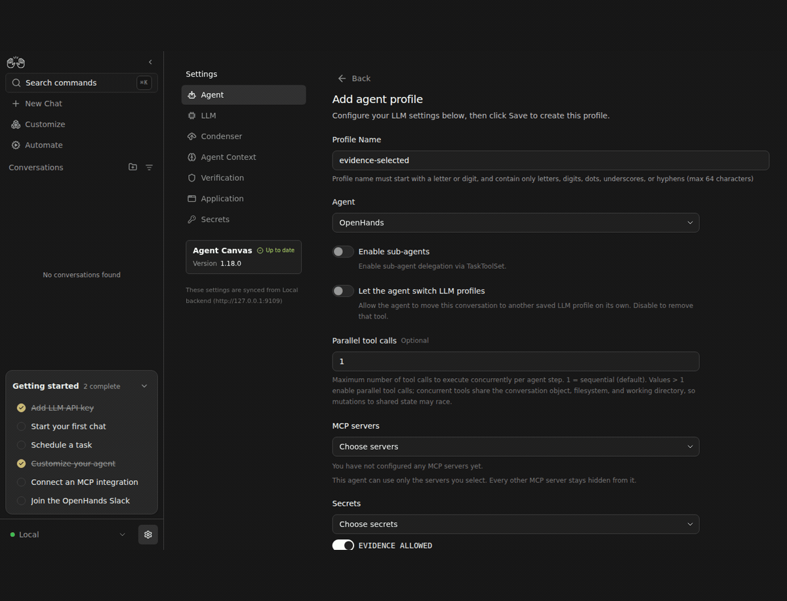

# Selected and empty profiles: live Canvas evidence

The UI saved one-secret and empty profiles. Real agent terminal calls wrote true/false and false/false respectively. Each conversation had exactly one SystemPromptEvent: selected advertised EVIDENCE_ALLOWED only; empty advertised neither. No synthetic value appeared in either prompt.

[Exact revisions and allowlisted observations](sdk4931-profile-scopes.json). This was a disposable Canvas configured through UI operations, using a real DeepSeek v4 Flash agent, two harmless synthetic saved secrets, and an uploaded test fixture. No repository or GitHub credential was used. The bundle attached through the public SDK. Its SHA256 was `ffaa73c82742204e7e84e29e92add8b911ec074e9359a0881ace29f80587e234`.

Integrated after demonstration: SDK `ac6d12b0b9d76f1cc38a6eb1ea51cd92e34a0bf2`, Automation `8abaa0b5fdea18132c68ef71dfd645c5aafcc13a`, Canvas `4cd1513bbe74abd2c1f9e58a77cf64375aafe001`. Early local queue/profile frames used Canvas `a3c7915`; final conversation/file frames include the later combined Logs/onboarding consumer refresh. This is direct enhancement evidence with companion changes identified, not a before/after claim.

Limits: ACP and every profile setting are not demonstrated. Null preserves request-provided secrets; it does not implicitly grant saved secrets. SDK5017 is the shell-delivery companion.

A private3GiB memory guard interrupted the comparison twice: one local run after its agent finished (explicitly cancelled and retried), and lifecycle inspection after both Docker jobs completed. Successful retry and lifecycle captures were recorded after resources recovered. Disconnection/capture-selector retry frames are excluded. All private services and containers were stopped afterward; the running software factory was untouched.
