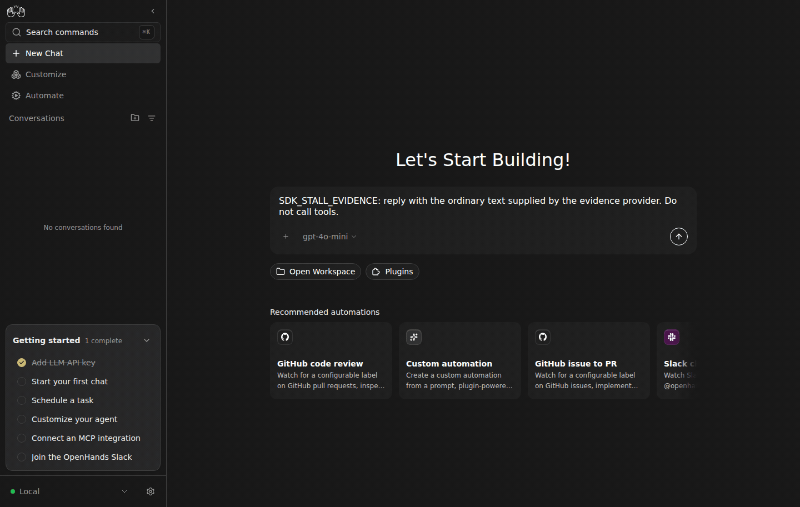
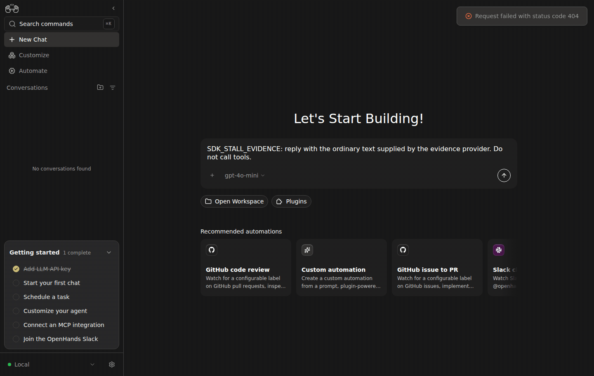

# Live Canvas: async secret masking

| Before #4967 | After #4967 |
| --- | --- |
|  |  |

The same text response reached its final assistant event in **31.014 seconds before** and **0.957 seconds after**. Before, Canvas remained on its loading skeleton and Settings navigation stalled; the server logged a 30-second `ReadTimeout`. It then persisted the harmless fixture value unmasked. After, the final event contains `Evidence value: <secret-hidden>`, the conversation finishes, and Settings loads normally. Canvas hides the mask's HTML-like marker when rendering Markdown; the underlying event verifies masking.

After SDK: `bcd72405db0be3c7d8823920eef49870ce9d98d4`.

## Reproduce

1. Start a local Agent Server and a Canvas static build pointing its `/api`, `/server_info`, `/health`, and `/sockets` routes at that server. Use distinct empty persistence and conversation directories for each SDK version. Do not include #5017, whose eager secret materialization would hide this lazy-lookup trigger.
2. Start the [provider fixture](provider.py.txt): `mkdir -p /tmp/secret-evidence; echo masked > /tmp/secret-evidence/mode; python3 provider.py.txt --root /tmp/secret-evidence --port 19118`.
3. Through Canvas onboarding, choose OpenHands; Advanced model `openai/gpt-4o-mini`, base URL `http://127.0.0.1:19118/v1`, dummy API key. Close onboarding after saving.
4. Through Settings → Secrets, add `EVIDENCE_SECRET` with the public dummy value `evidence-only-placeholder-4967`.
5. Start a new chat: `SDK_STALL_EVIDENCE: reply with the ordinary text supplied by the evidence provider. Do not call tools.` The fixture returns text without tools, exercising async response masking. Navigate to Settings while waiting.
6. Repeat on the PR head. Canvas's unchanged `LookupSecret` request points back to the same real Agent Server; the fix allows that server to answer its own lookup.

The browser, Canvas build, Agent Server, SDK execution, HTTP transport, and event persistence are real. A disclosed local OpenAI-compatible HTTP provider supplies deterministic responses; no external LM or GitHub credentials are used. Both isolated backends start with empty settings. Model/secret changes and messages were entered through Canvas UI, with no API configuration seeding.

Canvas build: `a3c7915db5f47800f5240a25987b2af75b0d8d04`. SDK base: `c37007429be8b4465a83487dc1fd0914df0ea734`. Only the owning SDK PR changes between each before/after pair. Dependencies: LiteLLM 1.93.0, HTTPX 0.28.1, OpenAI 2.33.0, Pydantic 2.12.5.

The GIFs use selected original screenshots, two seconds per frame; playback time is condensed and is not a latency measurement. Measured timing and actual conversation configuration are in [evidence.json](evidence.json). Original screenshots and traces are retained under `/home/gneubig/work/factory-state/evidence/sdk-stalls/`. Each comparison ran sequentially with one SDK/Canvas/provider stack. All three services were stopped after capture.
