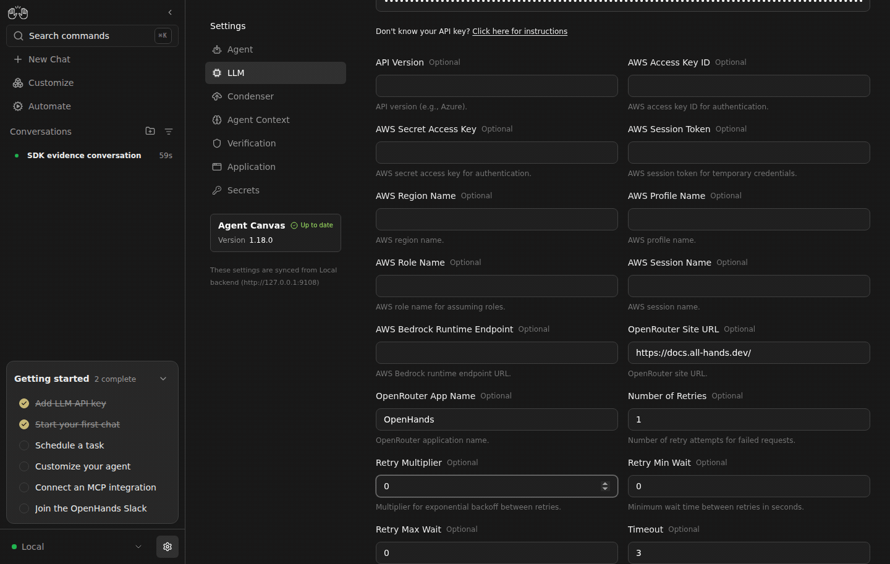
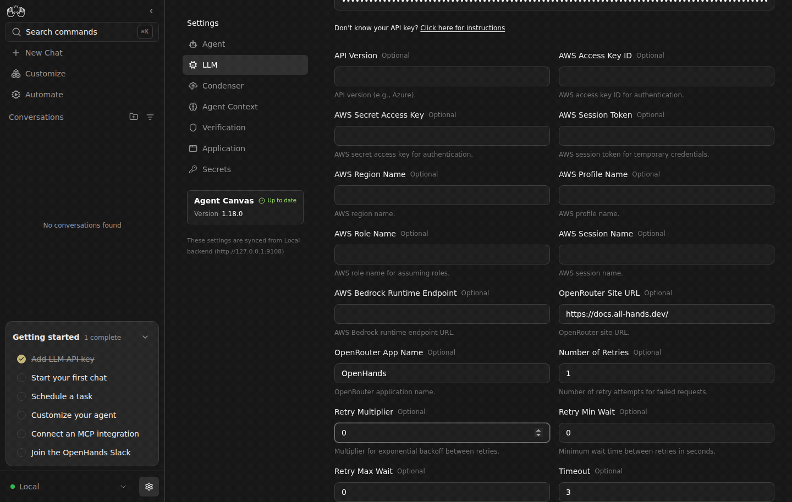

# Live Canvas: bounded asynchronous model streams

| Before #5000 | After #5000 |
| --- | --- |
|  |  |

With an actual **3-second timeout and one attempt**, the base continued Running **11.233 seconds after provider start**, despite receiving a chunk every 250 ms. The PR head emitted `LLM hard timeout after 3 seconds` **2.939 seconds after the provider received its request** (the SDK timer begins earlier). After making the fixture healthy, another message in that same conversation produced `EVIDENCE_RECOVERED` and a persisted `finished` state.

A second head-only conversation used timeout=30 and stream_idle_timeout=2. One chunk followed by silence produced `LLM stream idle timeout after 2 seconds` in Canvas after **2.018 seconds**. The continuous-chunk comparison distinguishes the new hard timer from the HTTP library's existing read timeout.

After SDK: `ba6c21735e44c28d476563e74ea8765d22c666a1`.

## Reproduce

1. Start each SDK version behind the same Canvas static build, sequentially, using distinct empty persistence/conversation directories.
2. Start the [provider fixture](provider.py.txt): `mkdir -p /tmp/stream-evidence; echo continuous > /tmp/stream-evidence/mode; python3 provider.py.txt --root /tmp/stream-evidence --port 19118`.
3. Configure `openai/gpt-4o-mini` and `http://127.0.0.1:19118/v1` with a dummy API key through onboarding. Then use **Settings → LLM → Profile menu → Edit → All** to set timeout=3, num_retries=1, and retry min/max/multiplier=0; Save. Canvas streams conversation replies.
4. Start a new chat: `SDK_STALL_EVIDENCE: demonstrate how Canvas handles a provider that never finishes its stream.` Record Running past the deadline on base, and Error on head.
5. On head, `echo healthy > /tmp/stream-evidence/mode`, then send another message in the same conversation. It finishes normally.
6. Edit the saved profile to timeout=30 and stream_idle_timeout=2; Save. Set fixture mode to `idle` and start another `SDK_STALL_EVIDENCE` chat to see the idle-specific timeout.

**Excluded exploratory run:** the onboarding All form displayed changed timeout/retry values but its generated profile retained defaults. We discovered the mismatch by inspecting the actual agent configuration, corrected it through the existing profile editor, and reran. Conversation `2a687d2b-719b-404c-86de-c751db0e3f5e` and its screenshots are excluded from the GIF and valid comparison. The retained valid base conversation is `2a07ea54-a2c8-419c-a8df-a198c8e4bd6f`.

The browser, Canvas build, Agent Server, SDK execution, HTTP transport, and event persistence are real. A disclosed local OpenAI-compatible HTTP provider supplies deterministic responses; no external LM or GitHub credentials are used. Both isolated backends start with empty settings. Model/secret changes and messages were entered through Canvas UI, with no API configuration seeding.

Canvas build: `a3c7915db5f47800f5240a25987b2af75b0d8d04`. SDK base: `c37007429be8b4465a83487dc1fd0914df0ea734`. Only the owning SDK PR changes between each before/after pair. Dependencies: LiteLLM 1.93.0, HTTPX 0.28.1, OpenAI 2.33.0, Pydantic 2.12.5.

The GIFs use selected original screenshots, two seconds per frame; playback time is condensed and is not a latency measurement. Measured timing and actual conversation configuration are in [evidence.json](evidence.json). Original screenshots and traces are retained under `/home/gneubig/work/factory-state/evidence/sdk-stalls/`. Each comparison ran sequentially with one SDK/Canvas/provider stack. All three services were stopped after capture.
