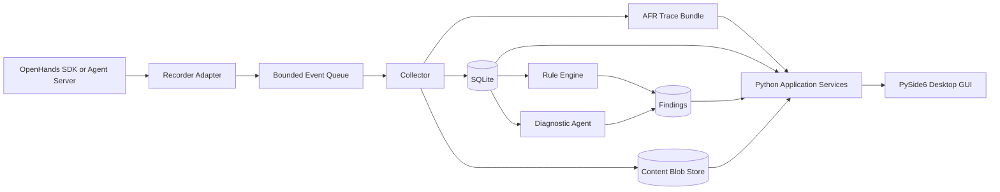

# Agent Flight Recorder

Status: Proposed
Date: 2026-09-01
Target: OpenHands Software Agent SDK and Python desktop GUI

## 1. Summary

Agent Flight Recorder is a local-first observability and diagnostics system for
OpenHands agent runs. It records conversation events, agent and subagent
relationships, LLM requests and responses, tool activity, context condensation,
workspace changes, token usage, cost, latency, retries, errors, and termination
reasons.

The system presents this data in a standalone Python desktop GUI built with
PySide6. Its primary view is an interactive swimlane timeline linked to a trace
tree and detail inspector. A separate diagnostic layer detects unproductive
loops, poor context selection, failed handoffs, expensive prompts, lost
requirements, and premature completion.

Collection is deterministic. LLM-based analysis never participates in the
observed run and cannot modify its workspace.

## 2. Problem

Agent failures are difficult to understand from terminal logs alone. Important
evidence is distributed across conversation events, model calls, tool results,
subagent runs, test output, context summaries, and file changes.

Developers need to answer questions such as:

- What information did the model receive before this decision?
- Which agent or tool caused a change?
- Why did the system repeat an action?
- Which facts were removed or distorted during context condensation?
- Did a subagent return useful evidence to its parent?
- Why did the run stop?
- Where were tokens, time, and money spent?
- What is the smallest change that would improve the next run?

## 3. Goals

1. Reconstruct the visible execution history of an OpenHands run.
2. Show exact model-visible input and visible model output when LLM logging is
   enabled.
3. Correlate agents, LLM calls, tools, files, tests, and condensation events.
4. Stream new activity to a UI while a run is executing.
5. Detect common context and loop failures with evidence-backed findings.
6. Measure recorder overhead and diagnostic accuracy.
7. Support local SDK conversations first and remote Agent Server runs second.
8. Deliver all visible application components as a native Python GUI without a
  browser or JavaScript runtime.

## 4. Non-goals

- Replacing OpenHands conversation persistence.
- Allowing the diagnostic agent to edit code or control the observed run.
- Building a general log management platform.
- Supporting distributed production deployment in the first milestone.
- Inferring causality when the trace contains no supporting evidence.

## 5. Design Principles

### 5.1 Observe without controlling

Recorder failure must not fail the observed agent run. Instrumentation writes to
a bounded queue, and callback exceptions are contained and reported separately.

### 5.2 Preserve facts before interpretation

Raw OpenHands event identities and ordering metadata are retained. Derived spans
and findings refer back to those immutable records.

### 5.3 Separate capture from diagnosis

Capture uses code and structured SDK callbacks. Rules and diagnostic models read
stored traces after or alongside collection.

### 5.4 Every diagnosis needs evidence

A finding must cite event, LLM call, artifact, or test-result identifiers.
Unsupported explanations are not displayed as facts.

## 6. User Stories

### Run investigator

As a developer, I can open a failed run, select an iteration, inspect the exact
context sent to the model, and compare it with the preceding iteration.

### Orchestration designer

As an agent developer, I can see parent-child agent relationships, handoff
payloads, parallel execution, wait time, and reducer output.

### Context engineer

As a context engineer, I can see which events entered each LLM call, which were
removed by condensation, and whether important requirements survived.

### Loop engineer

As a loop engineer, I can identify repeated tool calls, recurring failures,
iterations without workspace progress, and the final stopping condition.

### Cost investigator

As a developer, I can attribute tokens, latency, and cost to a model call,
agent, iteration, and complete run.

## 7. System Context



## 8. OpenHands Integration Points

### 8.1 Conversation events

Attach a callback through `Conversation(callbacks=[...])`. Each OpenHands
`Event` provides an ID, timestamp, source, and `parent_id`. The adapter stores
the event's discriminated type and serialized payload.

OpenHands invokes user callbacks before its default state-persistence callback.
The recorder therefore treats callback data as observed events and does not read
conversation state from inside the callback.

### 8.2 Streaming output

Attach `Conversation(token_callbacks=[...])` when live token display is enabled.
Chunks are streamed to connected clients but are not persisted individually by
default. The completed response is the durable record.

### 8.3 Exact LLM calls

Enable OpenHands completion logging and register both telemetry callbacks.
`llm.telemetry.set_log_requests_callback(...)` receives the exact request context
immediately before each provider transport attempt. The completion callback
receives the response or final error, cost, timestamp, latency, and usage. A
generated `llm_call_id` correlates each request with its result.

For remote conversations, consume `LLMCompletionLogEvent`, whose `log_data`
contains the JSON-encoded completion record and whose fields include model and
usage identifiers.

Conversation events alone are not considered an exact reconstruction of a model
request. Context condensation, message merging, tool schemas, and provider
options can make the final request differ from a projection of the event log.

### 8.4 Metrics

Read snapshots from conversation statistics or LLM metrics. OpenHands exposes
per-call and accumulated values for:

- Prompt and completion tokens
- Cache read and write tokens
- Reasoning tokens
- Context-window size
- Cost
- Response latency
- Response ID

The response ID is used to correlate metrics with LLM output and action events.

### 8.5 Context condensation

Record every `Condensation` event. It identifies forgotten event IDs, the
generated summary, summary insertion offset, and the LLM response that produced
it. The UI can therefore show a before-and-after context view without guessing
which events were removed.

### 8.6 Agent and subagent lineage

Within a conversation, OpenHands `parent_id` values define the event tree.
Cross-conversation delegation needs explicit trace propagation. The orchestration
adapter assigns one `trace_id` to the complete run and passes a
`parent_agent_span_id` when creating each delegated conversation or workflow
agent.

Until cross-conversation propagation is implemented, the UI labels inferred
relationships as unverified rather than presenting them as authoritative.

## 9. Proposed Architecture

### 9.1 Recorder Adapter

A small Python package embedded in the process running the OpenHands SDK.

Responsibilities:

- Create run and agent span identifiers.
- Convert callbacks into versioned recorder envelopes.
- Correlate OpenHands event and response IDs.
- Propagate trace context into delegated work.
- Send records to an in-process bounded queue.
- Drop or truncate content according to configured size limits.
- Never block on database or network I/O in an OpenHands callback.

### 9.2 Collector

A background worker that validates, normalizes, and persists batches.

Responsibilities:

- Assign a monotonically increasing sequence number per run.
- Deduplicate records by producer ID and source event ID.
- Store searchable metadata in SQLite.
- Store optional large content as compressed blobs.
- Publish committed records to live UI subscribers.
- Expose queue pressure and dropped-record counters.

### 9.3 Trace Store

SQLite in write-ahead logging mode is sufficient for the local MVP. Structured
metadata remains queryable while potentially large prompt, response, and tool
payloads live in compressed content blobs.

The portable `.afr` trace bundle is the canonical record. SQLite is a local
query index built from that bundle and can be deleted and regenerated without
losing trace information. The bundle and database schemas are
migration-controlled. Recorder envelopes retain a `schema_version` so imported
traces can be upgraded.

### 9.4 Rule Engine

Deterministic detectors run on committed trace records. Rules are inexpensive,
repeatable, testable, and suitable for live warnings.

### 9.5 Diagnostic Agent

An optional read-only agent analyzes a bounded evidence packet after deterministic
rules run. It receives excerpts and identifiers, not database access or workspace
tools. Its output must satisfy a strict finding schema.

### 9.6 Python Application Services

Python service classes provide trace queries, bundle import and export,
diagnostic execution, and live subscriptions. They are independent of Qt so the
same behavior can be tested headlessly and reused by the command-line tools.

When the recorder and GUI share a process, the collector publishes committed
record batches through a Qt signal adapter. When an observed OpenHands run is in
another process, the GUI tails its active `.afr/records.jsonl` file and refreshes
from the last committed sequence. `QFileSystemWatcher` provides notifications
with a short polling fallback because filesystem notification coalescing differs
by platform.

The MVP does not start an HTTP server or require a browser. A remote API may be
added later as an optional adapter without changing the application services or
trace format.

### 9.7 Trace UI

A standalone PySide6 desktop application uses a swimlane timeline as the primary
run overview. `QMainWindow`, `QSplitter`, `QTreeView`, `QTabWidget`, and a custom
`QGraphicsView` timeline provide synchronized drill-down into agent lineage, LLM
context, tool activity, artifacts, metrics, and findings.

Database access, bundle parsing, diagnostics, and other blocking work run outside
the GUI thread. Worker objects communicate immutable view models to widgets with
Qt signals and slots. The GUI remains read-only with respect to the observed
agent workspace.

## 10. Trace Model

The model follows OpenTelemetry concepts while preserving OpenHands-specific
data. A future OTLP exporter should not require replacing the internal schema.

### 10.1 Hierarchy

```text
Trace: one user task or orchestration run
  Run span
    Agent span
      Iteration span
        LLM span
        Tool span
        Condensation span
      Delegated agent span
    Evaluation span
```

### 10.2 Event envelope

```json
{
  "schema_version": 1,
  "record_id": "uuid",
  "producer_id": "sdk-process-uuid",
  "trace_id": "uuid",
  "span_id": "uuid",
  "parent_span_id": "uuid-or-null",
  "agent_span_id": "uuid-or-null",
  "sequence": 42,
  "observed_at": "2026-09-01T12:00:00.000Z",
  "source_timestamp": "2026-09-01T11:59:59.950Z",
  "monotonic_ns": 8273649123000,
  "kind": "llm.response",
  "openhands_event_id": "uuid-or-null",
  "llm_call_id": "request-attempt-uuid-or-null",
  "llm_response_id": "provider-response-id-or-null",
  "payload": {},
  "content_ref": "sha256-or-null"
}
```

Timestamps are descriptive. `sequence` is the authoritative display order for
records committed by one collector. `monotonic_ns` is optional and is used only
to calculate durations between records from the same producer. It must not be
compared across processes. `agent_span_id` is a denormalized reference to the
owning swimlane and avoids repeatedly walking the span tree during live updates.

### 10.3 Core record kinds

```text
run.started                 run.finished
agent.started               agent.finished
iteration.started           iteration.finished
conversation.event          conversation.status_changed
llm.request                 llm.stream_delta
llm.response                llm.error
llm.retry                   llm.metrics
tool.request                tool.result
tool.error                  context.condensed
delegation.started          delegation.finished
workspace.snapshot          workspace.diff
test.started                test.finished
budget.warning              recorder.warning
finding.created
```

### 10.4 SQLite tables

#### `runs`

`trace_id`, task label, status, start and end time, stop reason, repository
identity, recorder version, total tokens, cost, and latency.

#### `spans`

`span_id`, `trace_id`, `parent_span_id`, type, name, agent identity, model,
status, start and end sequence, start and end time, and attributes JSON.

#### `records`

Envelope fields, record kind, correlation identifiers, searchable summary,
payload JSON, and content reference.

#### `llm_calls`

Call and response IDs, model, usage ID, request and response references, finish
reason, token counts, cache counts, cost, latency, retry count, context hash,
and status.

#### `artifacts`

Artifact ID, trace and span IDs, kind, path, content hash, MIME type, size,
created sequence, and optional content reference.

#### `findings`

Finding ID, trace ID, rule or analyzer ID, category, severity, confidence,
title, explanation, recommendation, evidence references, status, and creation
time.

#### `content_blobs`

SHA-256 hash, compression, byte length, media type, and content. Identical content
is stored once.

### 10.5 Portable Trace File Format

The canonical portable output is an Agent Flight Recorder trace bundle. An
active trace is a directory named `<trace_id>.afr`. A finalized trace may remain
a directory or be packaged as `<trace_id>.afr.zip` without changing its internal
layout.

```text
<trace_id>.afr/
  manifest.json
  records.jsonl
  findings.jsonl
  content/
    <sha256>.json.zst
    <sha256>.txt.zst
  checksums.sha256
```

#### `manifest.json`

The manifest describes the bundle and the final run state:

```json
{
  "format": "agent-flight-recorder",
  "format_version": 1,
  "trace_id": "uuid",
  "created_at": "2026-09-01T12:00:00.000Z",
  "completed_at": "2026-09-01T12:04:32.000Z",
  "status": "completed",
  "stop_reason": "agent_finished",
  "recorder_version": "0.1.0",
  "record_count": 142,
  "finding_count": 3,
  "content_encoding": "zstd"
}
```

During an active run, `completed_at`, `stop_reason`, counts, and checksums may be
absent. Finalization writes the completed manifest atomically and then writes
`checksums.sha256`. Adding findings after a run completes returns the directory
to an unfinalized state; the recorder updates the manifest and checksums before
exporting a new immutable `.afr.zip`.

#### `records.jsonl`

`records.jsonl` is the append-only source of truth for observed activity. Each
UTF-8 line is one event envelope from section 10.2. Requirements:

- Lines are ordered by strictly increasing `sequence` within the trace.
- Every `record_id` is unique within the bundle.
- Re-ingesting the same `record_id` is idempotent.
- Each line is independently valid JSON and ends with a newline.
- A span's starting record carries its name, type, lane label, and attributes.
- Its matching terminal record uses the same `span_id` and carries status, stop
  reason when applicable, and `duration_ms`.
- `parent_span_id` must resolve to another span in the bundle or be explicitly
  marked unresolved in the payload.
- Large content uses `content_ref`; it is not duplicated in the envelope.

Timeline span lifecycles use these record-kind pairs:

| Span type | Starting kind | Terminal kind |
| --- | --- | --- |
| Run | `run.started` | `run.finished` |
| Agent | `agent.started` | `agent.finished` |
| Iteration | `iteration.started` | `iteration.finished` |
| Delegation | `delegation.started` | `delegation.finished` |
| LLM | `llm.request` | `llm.response` or `llm.error` |
| Tool | `tool.request` | `tool.result` or `tool.error` |
| Test | `test.started` | `test.finished` |

`conversation.event`, `context.condensed`, warnings, workspace snapshots,
workspace diffs, and findings are instantaneous records unless their payload
explicitly references a containing span.

Example span pair:

```json
{"schema_version":1,"record_id":"rec-10","producer_id":"proc-1","trace_id":"trace-1","span_id":"llm-3","parent_span_id":"iteration-2","agent_span_id":"agent-1","sequence":10,"observed_at":"2026-09-01T12:00:02.000Z","source_timestamp":"2026-09-01T12:00:02.000Z","monotonic_ns":2000000000,"kind":"llm.request","openhands_event_id":null,"llm_response_id":null,"payload":{"span_type":"llm","name":"Planning completion","lane_label":"Main agent","model":"gpt-5.5","status":"running"},"content_ref":"sha256:0123456789abcdef0123456789abcdef0123456789abcdef0123456789abcdef"}
{"schema_version":1,"record_id":"rec-11","producer_id":"proc-1","trace_id":"trace-1","span_id":"llm-3","parent_span_id":"iteration-2","agent_span_id":"agent-1","sequence":11,"observed_at":"2026-09-01T12:00:03.250Z","source_timestamp":"2026-09-01T12:00:03.250Z","monotonic_ns":3250000000,"kind":"llm.response","openhands_event_id":"event-7","llm_response_id":"response-9","payload":{"status":"completed","duration_ms":1250,"prompt_tokens":1240,"completion_tokens":183,"cost":0.014},"content_ref":"sha256:abcdef0123456789abcdef0123456789abcdef0123456789abcdef0123456789"}
```

#### `findings.jsonl`

Each UTF-8 line is one diagnostic finding using the schema in section 13.2.
Findings are separate because analysis may run after trace finalization. Every
evidence ID must resolve to a record or span in `records.jsonl`.

#### `content/`

Optional content is addressed by SHA-256 of the exact uncompressed bytes. A
reference has the form `sha256:<64 lowercase hexadecimal characters>`. The
filename is the hash without the prefix, followed by a media suffix and optional
`.zst` compression suffix. Importers verify the hash after decompression and
reject path traversal or unsupported content types.

#### `checksums.sha256`

The finalized bundle contains SHA-256 checksums for the manifest, JSONL files,
and every content blob. The checksum file itself is not included in its own
checksum list. Active traces may omit this file.

#### Compatibility rules

- Readers must reject unsupported major `format_version` values.
- Readers must ignore unknown envelope fields and preserve unknown record kinds.
- Import builds a fresh SQLite index; database files are never included in the
  portable bundle.
- A truncated final JSONL line after a crash is ignored and reported as a
  recorder warning; all preceding complete lines remain valid.

### 10.6 Timeline Projection

The swimlane timeline is a deterministic projection of `records.jsonl`, not a
separate source of truth:

1. Group records by `agent_span_id` to create agent swimlanes.
2. Order lanes by the `sequence` of their `agent.started` record, nesting child
   agents immediately below their parent.
3. Pair start and finish records by `span_id` to create timeline bars.
4. Use `observed_at` for cross-process placement and same-producer
   `monotonic_ns` or recorded `duration_ms` for bar width.
5. Render unfinished spans from their start time to the latest observed record
   and mark them incomplete.
6. Place instantaneous events such as warnings and condensation at their
   observed timestamp.
7. Break timestamp ties with `sequence`.

This projection guarantees that the CLI, desktop GUI, and imported trace show
the same lane ordering and span relationships.

## 11. Run and Span State

Run states are:

```text
CREATED -> RUNNING -> COMPLETED
                   -> FAILED
                   -> PAUSED -> RUNNING
                   -> INTERRUPTED
```

Every terminal run state requires a `stop_reason`, such as:

```text
agent_finished
acceptance_tests_passed
iteration_limit
budget_exceeded
stuck_detected
user_interrupt
uncaught_error
recorder_import
unknown
```

Recorder warnings do not change the observed run state.

## 12. Context Reconstruction

For each LLM call, the recorder stores:

- Final messages sent to the provider after condensation and projection
- System prompt and activated skills
- Tool definitions visible to the model
- Model and request options
- Visible response text and tool calls
- Token usage, cost, latency, and finish reason
- IDs of contributing conversation events when known
- A stable hash of the context

The context view supports:

1. **Exact view:** the captured final request.
2. **Source view:** contributing OpenHands events.
3. **Diff view:** additions and removals since the preceding call in the same
   agent span.
4. **Condensation view:** forgotten events beside the replacement summary.
5. **Budget view:** token contribution by message, tool schema, and content
   category when tokenization data is available.

If completion logging is disabled, the UI marks context as reconstructed and
does not call it exact.

## 13. Intelligent Diagnostics

### 13.1 Rule-based detectors

The MVP implements these detectors first:

| Detector | Trigger | Evidence |
| --- | --- | --- |
| Repeated tool call | Same normalized tool and arguments repeated without a relevant workspace change | Tool request and result IDs |
| Recurring failure | Same normalized error signature occurs at least twice | Test or tool result IDs |
| No-progress iteration | Iteration completes with no new evidence, artifact, or workspace diff | Iteration and artifact IDs |
| Context growth | Prompt tokens grow past a configured slope or context percentage | Consecutive LLM call IDs |
| Context churn | Large context replacement produces semantically equivalent action | LLM and condensation IDs |
| Lost requirement | A required statement is removed and absent from the condensation summary | Original and condensation IDs |
| Idle delegation | A delegated agent consumes budget but returns no evidence or artifact | Delegation and child span IDs |
| Handoff mismatch | Child output does not address the requested handoff contract | Delegation record IDs |
| Premature finish | Agent finishes while recorded acceptance tests are failing or absent | Finish and test IDs |
| Budget hotspot | One span consumes more than its configured share of run cost | Span and LLM call IDs |

Normalized fingerprints ignore timestamps, temporary paths, generated IDs, and
known nondeterministic output.

### 13.2 Diagnostic agent

The diagnostic agent receives:

- Run goal and explicit acceptance criteria
- Span summaries
- Existing deterministic findings
- Selected context diffs
- Failure signatures
- Workspace diff summaries
- Token, cost, and latency outliers

It returns JSON matching:

```json
{
  "summary": "string",
  "findings": [
    {
      "category": "loop|context|delegation|tool|cost|termination",
      "severity": "info|warning|error",
      "confidence": 0.0,
      "title": "string",
      "explanation": "string",
      "evidence_ids": ["record-or-span-id"],
      "recommendation": "string"
    }
  ]
}
```

The service rejects findings with nonexistent evidence IDs. Diagnostic prompt
content is untrusted data and cannot grant tools or alter system instructions.

### 13.3 Example finding

```text
Warning: Repeated failure without progress

Iterations 6 through 8 ran the same test command and produced the same failure
signature. No relevant file changed between those commands.

Evidence: tool-31, test-14, tool-38, test-15, diff-7
Recommendation: Re-evaluate the suspected implementation path before retrying.
```

## 14. User Interface

### 14.1 Run list

- Status, task label, duration, cost, tokens, agent count, and finding count
- Filters for model, status, date, repository, and finding severity
- Comparison selection for two runs

### 14.2 Trace workspace

The swimlane timeline is the primary experience for understanding a run at a
glance. It is surrounded by two synchronized panes rather than presented as a
secondary chart:

```text
+ Task, status, duration, tokens, cost, stop reason -------------------+
| Trace tree   | Swimlane timeline                     | Inspector     |
|              |                                       |               |
| Main agent   | [LLM]--[tool]-----[LLM]               | Input         |
|   Code scout |      [------ delegated agent ------]   | Output        |
|   Test scout |      [---- delegated agent ----]       | Context diff  |
|   Reviewer   |                            [review]     | Metrics       |
|              |  ! condensation   x failed test        | Evidence      |
+--------------+---------------------------------------+---------------+
| Findings and workspace-change track                                  |
+----------------------------------------------------------------------+
```

1. **Trace tree:** agents, iterations, LLM calls, tools, tests, and findings.
2. **Swimlane timeline:** duration, parallel work, retries, state changes, and
  warnings along a shared time axis.
3. **Inspector:** structured input, output, context, metrics, diffs, and evidence
  for the current selection.

The timeline uses one stable lane per agent. Child-agent lanes are nested below
their parent and remain in creation order, so live updates do not rearrange the
screen. Iterations form subtle lane regions; LLM, tool, test, condensation, and
delegation spans appear inside them. Bar width always represents elapsed time.
Tokens and cost are separate labels or tracks and never alter bar width.

Visual semantics are consistent across every run:

- LLM spans use one color and model icon.
- Tool and test spans use distinct colors and familiar icons.
- Failed spans use an error outline and terminal marker.
- Retries connect to the preceding attempt.
- Condensation and diagnostic findings appear as point markers.
- Solid lineage indicates recorded parentage; dotted lineage indicates an
  inferred relationship.
- Incomplete spans and reconstructed context have visible badges.

Long traces use horizontal zoom, a minimap, virtualized lanes, and collapsible
iterations. Raw token deltas are hidden by default to avoid overwhelming the
overview.

### 14.3 Timeline interaction and drill-down

Selecting a bar, marker, or trace-tree item synchronizes all panes and opens the
inspector without leaving the timeline. The selected item is centered and its
ancestors, descendants, and evidence references are highlighted.

The inspector provides tabs appropriate to the selected span:

- **Summary:** status, duration, agent, model or tool, and parent relationship.
- **Input:** handoff request, LLM request, tool arguments, or test command.
- **Output:** visible model response, tool result, test output, or agent return.
- **Context:** exact or reconstructed model context and previous-call diff.
- **Changes:** workspace diff and artifacts produced during the span.
- **Metrics:** tokens, cache use, cost, latency, retries, and budget percentage.
- **Evidence:** findings that cite the span and records supporting those findings.

A playback control moves through `sequence` values and reveals the run state at
that point. Deep links encode `trace_id`, selected `span_id` or `record_id`, and
the active inspector tab.

### 14.4 Context inspector

- Exact or reconstructed status badge
- Message and tool-schema token breakdown
- Previous-call diff
- Condensation before-and-after view
- Links from each source event to its place in the timeline

### 14.5 Orchestration view

- Parent-child agent graph
- Handoff request and returned result
- Parallel execution and waiting time
- Per-agent cost and token totals
- Unverified lineage warning where trace propagation is unavailable

### 14.6 Findings panel

- Severity and confidence
- Concise explanation
- Clickable evidence references
- Suggested experiment or configuration change
- User disposition: confirmed, dismissed, or unresolved

### 14.7 Python GUI implementation

PySide6 is the required GUI toolkit for the first release. The application uses
Qt's model/view architecture so trace data is not copied into every widget.

| Visible component | PySide6 implementation |
| --- | --- |
| Application shell | `QMainWindow` with persistent geometry and layout |
| Run browser | `QTableView` backed by `QAbstractTableModel` |
| Trace hierarchy | `QTreeView` backed by `QAbstractItemModel` |
| Swimlane timeline | Custom `QGraphicsView` and `QGraphicsScene` |
| Detail inspector | `QTabWidget` containing read-only structured views |
| Context and text diff | Read-only `QPlainTextEdit` with syntax highlighting |
| Metrics | Lightweight custom Qt charts; add PyQtGraph only if profiling shows a need |
| Findings | Filterable `QListView` with severity delegates |
| Import and export | `QFileDialog` using `.afr` and `.afr.zip` filters |
| Status and progress | `QStatusBar` and cancellable `QProgressDialog` |

The custom timeline scene owns viewport-scale rendering, hit testing, zoom, and
selection. It receives immutable `TimelineLane` and `TimelineItem` view models;
it does not query SQLite during paint events. Items outside the visible time
range are not instantiated, which keeps long traces responsive.

Widget selection is coordinated by one `SelectionController`. Selecting a
timeline item, tree node, evidence link, or workspace change updates the same
selected record or span and prevents circular signal updates.

### 14.8 Accessibility and desktop behavior

- Full keyboard navigation for the run list, tree, timeline, and inspector.
- Text alternatives and tooltips for icons, colors, and timeline markers.
- Status never depends on color alone.
- High-DPI rendering and platform font metrics determine dimensions.
- Light and dark palettes follow the operating-system preference.
- Layout geometry, column widths, and filters persist through `QSettings`.
- Copy actions use the displayed content.
- Closing during recording prompts before detaching from an active trace.

## 15. Python Application Interfaces

The GUI depends on Python protocols rather than HTTP endpoints or Qt widgets
performing direct storage access:

```python
from collections.abc import Callable, Iterable
from pathlib import Path
from typing import Protocol


class TraceRepository(Protocol):
  def list_runs(self, query: "RunQuery") -> list["RunSummary"]: ...
  def get_run(self, trace_id: str) -> "RunDetail": ...
  def get_timeline(self, trace_id: str) -> "TimelineView": ...
  def get_span(self, trace_id: str, span_id: str) -> "SpanDetail": ...
  def iter_records(self, trace_id: str, after: int = 0) -> Iterable["Record"]: ...
  def get_findings(self, trace_id: str) -> list["Finding"]: ...


class BundleService(Protocol):
  def import_bundle(self, source: Path) -> str: ...
  def export_bundle(self, trace_id: str, destination: Path) -> Path: ...


class TraceSubscription(Protocol):
  def subscribe(
    self,
    trace_id: str,
    callback: Callable[["CommittedBatch"], None],
  ) -> "SubscriptionHandle": ...


class DiagnosticService(Protocol):
  def analyze(self, trace_id: str, include_llm: bool = False) -> list["Finding"]: ...
```

Concrete services use SQLite and `.afr` bundles. Qt worker adapters call these
interfaces outside the GUI thread and emit success, progress, or typed failure
signals. Batch ingestion remains idempotent by `record_id`; content services
provide content by reference.

## 16. Reliability and Performance

Initial service targets:

- Less than 5% median wall-clock overhead with token streaming disabled.
- Less than 50 ms callback time at the 99th percentile.
- No lost metadata records during a normal process shutdown.
- UI receives committed events within 500 ms locally.
- Opening a trace with 100,000 records reaches an interactive overview within
  three seconds on the reference development machine.
- Selection and inspector updates complete within 100 ms for an indexed trace.
- No database, decompression, diagnostic, or bundle-import work runs on the Qt
  GUI thread.
- A recorder failure never changes the OpenHands run result.
- Bounded memory under prolonged tool output.

Large payloads are truncated at the producer according to configured size limits.
Records enter a bounded queue. On pressure, the adapter drops live token chunks
first, then large duplicate content, but preserves run state, errors, final LLM
records, and drop counters.

## 17. Failure Handling

| Failure | Behavior |
| --- | --- |
| Collector unavailable | Buffer to a bounded local spool or continue with a warning |
| Invalid record | Quarantine metadata and increment validation counter |
| Database locked | Retry with bounded backoff; preserve queue order |
| GUI closes or detaches | Continue persistence; resume from the last indexed sequence when reopened |
| Active-bundle notification missed | Poll from the last sequence and deduplicate by record ID |
| GUI worker fails | Show a recoverable error without terminating collection |
| Analyzer failure | Mark analysis failed; retain deterministic findings |
| Unknown event type | Store type and safe serialized payload as a generic event |
| Process crash | Mark stale running traces as incomplete on next startup |

## 18. Evaluation Plan

### 18.1 Recorder correctness

- Every observed callback event is represented once.
- Parent links resolve or are explicitly marked missing.
- LLM calls correlate with metrics through response IDs.
- Condensation views remove exactly the recorded forgotten event IDs.

### 18.2 Diagnostic quality

Create seeded traces containing known problems:

- Repeated identical tool calls
- Repeated tests without code changes
- Requirement loss after condensation
- Unbounded context growth
- Subagent output ignored by its parent
- Passing tests followed by unnecessary work
- Failed tests followed by premature completion

Label expected findings and measure precision, recall, evidence validity, and
false-positive rate for each detector. Compare rules alone with rules plus the
diagnostic agent.

### 18.3 System performance

Replay the same tasks with recording disabled and enabled. Compare wall time,
CPU, memory, trace size, and dropped records.

Replay small, medium, and large trace fixtures in the desktop GUI. Measure first
interactive render, timeline pan and zoom latency, selection latency, peak
memory, and background indexing time.

## 19. Testing Strategy

### Unit tests

- Envelope validation and schema migration
- Record fingerprints and deduplication
- Detector boundaries and false-positive cases
- State transitions and stop-reason validation
- Context and condensation reconstruction

### Integration tests

- Local `Conversation` callback ingestion
- Completion-log callback ingestion
- Remote `LLMCompletionLogEvent` ingestion
- Parallel agent trace propagation
- Collector restart and idempotent batch replay
- Active `.afr` tailing from a sequence cursor
- Missed filesystem notification recovery
- Qt worker success, progress, cancellation, and failure signals

### GUI tests

- Use `pytest-qt` for widget behavior and signal synchronization.
- Run headlessly with `QT_QPA_PLATFORM=offscreen` in CI.
- Verify run-table, trace-tree, and timeline view models independently of paint
  behavior.
- Verify selection synchronization across tree, timeline, findings, and
  inspector.
- Verify zoom, hit testing, keyboard navigation, and incomplete-span rendering.
- Keep screenshot tests focused on stable layout states rather than font pixels.

### End-to-end tests

- Run a small coding task and inspect the complete timeline.
- Run a task that triggers condensation and compare contexts.
- Run parallel subagents and verify the orchestration graph.
- Produce a repeated failure and verify the evidence-backed warning.
- Launch the packaged desktop application, import an `.afr.zip`, select an LLM
  span, and inspect its input, output, context, and metrics.

## 20. Proposed Project Layout

```text
agent-flight-recorder/
  pyproject.toml
  README.md
  src/flight_recorder/
    __main__.py
    app.py
    adapter/
      conversation.py
      llm.py
      propagation.py
    collector/
      queue.py
      normalize.py
      persistence.py
    diagnostics/
      rules.py
      analyzer.py
      schemas.py
    models/
      envelopes.py
      database.py
      view_models.py
    services/
      repository.py
      bundles.py
      subscriptions.py
      diagnostics.py
    gui/
      main_window.py
      palette.py
      resources.py
      controllers/
        selection.py
      models/
        run_table.py
        trace_tree.py
      timeline/
        view.py
        scene.py
        layout.py
        items.py
      inspector/
        widget.py
        context.py
        diff.py
        metrics.py
      workers.py
    cli.py
  tests/
    unit/
    integration/
    gui/
    e2e/
    fixtures/traces/
```

### 20.1 Python dependencies and packaging

Core runtime dependencies are:

- `PySide6` for the complete desktop interface.
- `pydantic` for recorder and service models.
- `zstandard` for compressed content blobs.
- `platformdirs` for platform-correct application data and cache locations.

SQLite, JSON, hashing, ZIP handling, threading, and queueing use the Python
standard library where practical. `pytest`, `pytest-qt`, and the repository's
normal lint and type-check tools are development dependencies.

The `pyproject.toml` exposes a GUI entry point:

```toml
[project.gui-scripts]
agent-flight-recorder = "flight_recorder.app:main"
```

Development runs use `uv run agent-flight-recorder`. Release builds use
PyInstaller initially, producing a desktop executable that includes the Qt
plugins required by the target platform. Linux is the first supported packaging
target; Windows and macOS follow after the trace and GUI contracts stabilize.

## 21. Delivery Plan

### Milestone 1: Deterministic local recorder

- Instrument one local OpenHands conversation.
- Capture events, LLM completion logs, metrics, and run status.
- Persist records to an `.afr` bundle.
- Build the SQLite index and provide a command-line validation summary.

Exit criterion: a recorded sample run can be replayed as an ordered textual
timeline with correlated LLM usage.

### Milestone 2: Python desktop GUI

- Build the PySide6 application shell, run list, trace tree, swimlane timeline,
  and inspector.
- Add live updates through Qt signals and active-bundle tailing.
- Add context and workspace diff views.
- Package the Linux application with its Qt runtime dependencies.

Exit criterion: a developer can answer what the model saw, what it did, and how
much the step cost without reading raw log files or opening a browser.

### Milestone 3: Loop and context diagnostics

- Implement deterministic detectors.
- Add findings and evidence navigation.
- Build seeded trace fixtures and detector evaluation.

Exit criterion: seeded loop and context failures are detected with agreed
precision and no dangling evidence references.

### Milestone 4: Agent orchestration tracing

- Propagate trace context through delegated and workflow agents.
- Add agent graph, handoff inspection, and per-agent metrics.
- Trace parallel branches and reducer activity.

Exit criterion: all agents in a sample parallel workflow appear under one trace
with verified parentage.

### Milestone 5: Intelligent diagnosis

- Build bounded evidence packets.
- Add the read-only diagnostic agent and structured output validation.
- Compare rules-only and hybrid diagnostic performance.

Exit criterion: diagnostic output improves labeled-trace recall without
unacceptable false positives or unsupported claims.

### Milestone 6: Remote Agent Server support

- Ingest remote event and completion-log streams.
- Handle reconnect, replay, interruption, and incomplete runs.

Exit criterion: local and remote traces render through the same normalized
query model.

## 22. First Vertical Slice

The first implementation should remain deliberately small:

1. Wrap the condenser example in a recorder-enabled conversation.
2. Capture conversation events with a callback.
3. Capture exact LLM requests and responses with both telemetry callbacks.
4. Append normalized records to an `.afr` bundle.
5. Build the SQLite index and open the run in a PySide6 `QMainWindow`.
6. Render stable agent swimlanes with duration, status, tokens, and cost, and
  open a read-only detail inspector when a span is selected.
7. Show each condensation event with forgotten IDs and its summary.
8. Add one repeated-tool-call detector with evidence IDs.

This slice validates the most important architecture assumption: OpenHands event
callbacks and LLM telemetry can be correlated into one useful, interactive
desktop trace without changing the agent loop.

## 23. Risks and Mitigations

| Risk | Mitigation |
| --- | --- |
| Callback overhead changes agent behavior | Nonblocking queue, batching, overhead benchmarks |
| Event and LLM records do not correlate | Use response IDs and explicit adapter correlation; mark uncertainty |
| Cross-agent parentage is lost | Propagate trace context at orchestration boundaries |
| Diagnostic model hallucinates causes | Require existing evidence IDs and display confidence |
| Trace volume becomes excessive | Content addressing, compression, truncation, retention |
| SDK event schemas evolve | Version envelopes and preserve unknown event types |
| Users confuse reconstructed and exact context | Prominent provenance status in every context view |
| Large traces stall the GUI | Background indexing, immutable view models, visible-range scene items |
| Qt packaging differs by platform | Package and test one operating system first, then add platform CI |

## 24. Open Questions

1. Which orchestration boundary is the cleanest place to propagate trace context
   into every `TaskToolSet` and workflow subagent?
2. Should artifact content be stored, or should the MVP retain only paths,
   hashes, and diffs?
3. Which tokenizer should estimate per-message contributions when provider usage
   reports only aggregate tokens?
4. What precision threshold should a detector meet before it is enabled by
   default?
5. Which trace fields should map directly to OpenTelemetry GenAI semantic
   conventions?
6. Should a later release launch and control OpenHands runs from the GUI, or
  remain a strictly read-only recorder and trace viewer?

## 25. Acceptance Criteria for the MVP

The MVP is complete when:

- `uv run agent-flight-recorder` launches a standalone PySide6 desktop
  application without starting a browser or local web server.
- A local OpenHands run appears in an ordered trace timeline.
- The timeline uses stable agent swimlanes, shows parallel spans and elapsed
  time, and opens synchronized details when a span is selected.
- The trace includes conversation events, exact LLM request and visible response,
  tool activity, metrics, errors, and stop reason.
- The run exports as a valid `.afr.zip` bundle and produces the same timeline
  after import into an empty database.
- Condensation displays forgotten events and the replacement summary.
- At least one loop detector produces an evidence-linked finding.
- Recorder failure does not fail the observed conversation.
- An automated replay test proves that duplicate batches do not duplicate trace
  records.
- GUI interaction, live updates, selection synchronization, and import are
  covered by headless `pytest-qt` tests.
- Measured median runtime overhead remains below the initial 5% target.

## 26. Relevant OpenHands References

- `software-agent-sdk/examples/01_standalone_sdk/14_context_condenser.py`
- `software-agent-sdk/examples/01_standalone_sdk/25_agent_delegation.py`
- `software-agent-sdk/examples/01_standalone_sdk/31_iterative_refinement.py`
- `software-agent-sdk/examples/01_standalone_sdk/52_dynamic_workflow.py`
- `software-agent-sdk/openhands-sdk/openhands/sdk/conversation/impl/local_conversation.py`
- `software-agent-sdk/openhands-sdk/openhands/sdk/event/base.py`
- `software-agent-sdk/openhands-sdk/openhands/sdk/event/condenser.py`
- `software-agent-sdk/openhands-sdk/openhands/sdk/event/llm_completion_log.py`
- `software-agent-sdk/openhands-sdk/openhands/sdk/llm/utils/metrics.py`
- `software-agent-sdk/openhands-sdk/openhands/sdk/llm/utils/telemetry.py`